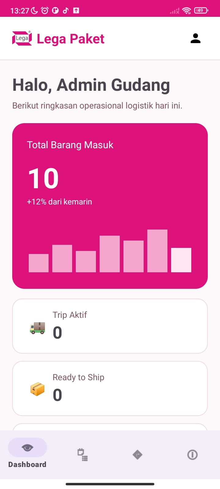
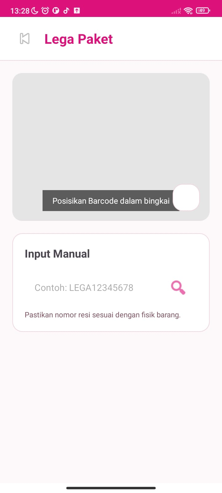
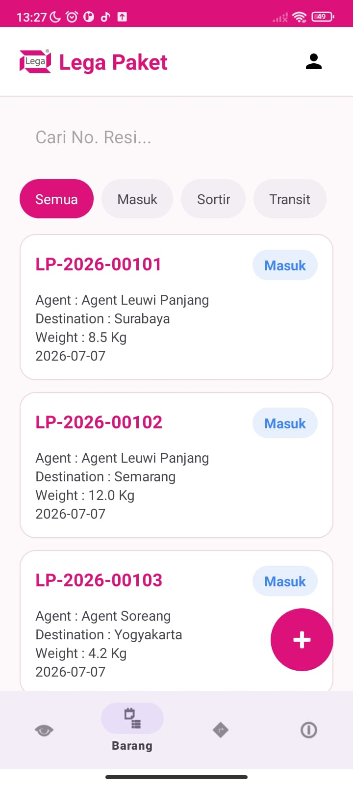
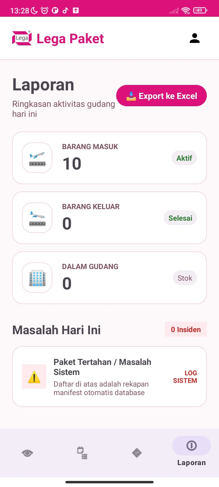

# 📦 Warehouse LegaPaket - Android Logistics Management System

## 01. Nama & Deskripsi Project
**Warehouse LegaPaket** adalah aplikasi manajemen operasional logistik gudang (*Warehouse Management System*) berbasis Android yang dikembangkan oleh **Kelompok 11** menggunakan bahasa pemrograman **Kotlin**. 

Aplikasi ini dirancang untuk mendigitalkan dan mengotomatisasi siklus rantai pasok kargo secara *end-to-end*. **Fitur utama unggulan dari aplikasi ini adalah sistem integrasi Barcode Scanner menggunakan Kamera HP secara real-time**. Petugas cukup mengarahkan kamera ke barcode paket untuk melakukan tracking, memicu pencarian data resi otomatis di database, dan memperbarui status kargo secara instan tanpa input manual. 

Selain itu, aplikasi ini mendukung manajemen barang masuk (inbound), penyortiran kargo berbasis kategori, perilisan manifes jalan armada pengiriman (trip), pelaporan insiden darurat paket di jalan, hingga analitik data operasional serta ekspor data fisik laporan ke format CSV.

Aplikasi ini dibangun menggunakan arsitektur penyimpanan lokal kustom yang sangat cepat dan ringan, yaitu memanfaatkan **SharedPreferences yang dikombinasikan dengan pustaka Google GSON** untuk proses serialisasi/deserialisasi objek JSON secara aman tanpa memerlukan database server eksternal.

---

## 02. Daftar Anggota
Proyek aplikasi ini dirancang, dikoding, dan diselesaikan sepenuhnya oleh pengembang tunggal (*Single Developer*):

* **Nama Lengkap:** Revan Dwiki Juniarta
* **NPM:** 24552011206
* **Kelompok:** 11 (Sebelas)
* **Peran:** Full-Stack Android Developer (UI/UX Designer, System Architect, & Core Programmer)

---

## 03. Link Video Penjelasan
Berikut adalah tautan langsung untuk melihat demonstrasi aplikasi serta bedah arsitektur source code secara mendalam:

* 📺 **Link Video YouTube:** https://youtu.be/sQxy0GGo3p4

---

## 04. Screenshot Aplikasi
Berikut adalah dokumentasi antarmuka (*user interface*) dari aplikasi Warehouse LegaPaket:

| Halaman Dashboard Analitik | Fitur Barcode Scanner Kamera |
| :---: | :---: |
|  |  |

| Daftar Manajemen Barang | Riwayat Aktivitas & Laporan |
| :---: | :---: |
|  |  |

---

## 05. Cara Menjalankan Project

Terdapat dua cara untuk menjalankan proyek ini: **Cara Cepat (Instalasi APK Rilis)** untuk langsung menguji aplikasi di perangkat Android, atau **Cara Developer (Cloning Source Code)** jika ingin membedah kode di Android Studio.

### Opsi A: Cara Cepat (Instalasi File APK)
Jika Anda hanya ingin langsung mencoba aplikasi di perangkat Android tanpa membuka *source code*:
1. Buka repositori ini, lalu masuk ke direktori folder `apk/`.
2. Unduh berkas file rilis yang ada di dalam folder tersebut (misal: `app-release.apk` atau nama berkas APK serupa).
3. Pindahkan file tersebut ke memori penyimpanan *smartphone* Android Anda.
4. Buka berkas `.apk` tersebut di HP, izinkan instalasi dari "Sumber Tidak Dikenal" (*Unknown Sources*) jika diminta oleh sistem operasi, lalu selesaikan proses instalasi.

---

### Opsi B: Cara Developer (Cloning & Push Terminal)
Jika Anda ingin membuka, memodifikasi, atau menjalankan kode program melalui Android Studio:

#### 1. Kloning Repositori & Sinkronisasi Folder
Buka terminal (Command Prompt / Git Bash) di komputer Anda, lalu jalankan perintah berikut untuk mengunduh folder proyek:
```bash
git clone [https://github.com/revandwikij/warehouse-legapaket.git](https://github.com/revandwikij/warehouse-legapaket.git)
